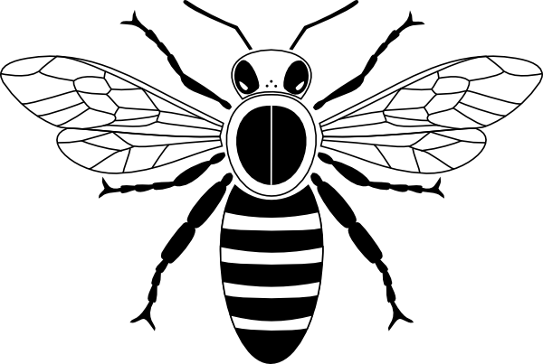

```{r setup, include=FALSE}
knitr::opts_chunk$set(echo = F,
                      warning = F,
                      message = FALSE, 
                      fig.align = 'left',
                      error=F,
                      results='asis')
```


```{r calculations, include=F}
#here you can do simple calculations for generating metrics that you later include in the text of the email. However if you wish to do more complex calculations it is recommended that these are done via prior (method tbc)


```

```{r packages, include =F}
library(dplyr) #wrangling
library(ggplot2) #plotting
library(htmltools)
library(tidyr)
library(knitr)
```

{width=250px}

# Hello `r params$user_name`!

## Summary

You have recorded **`r params$user_computed_objects$mean_n_insects`** insects in 2024 across **`r params$user_computed_objects$mean_n_fit_counts`** FIT counts. Nice one!

## Your last FIT Count

```{r}
last_count <- params$user_data %>% arrange(as.POSIXct(desc(date_from))) %>% head(1)

last_count2 <- last_count %>%
    pivot_longer(c(bumblebees,honeybees,solitary_bees,wasps,hoverflies,other_flies,butterflies_moths,beetles,insects_small,insects_other),names_to = "group",values_to = "count")

```

Your most recent FIT count you did was on `r last_count$date_from`, you recorded `r last_count$all_insects_total` insects and the target flower was: `r last_count$target_flower`.

```{r}
last_count2 %>% ggplot(aes(x= group, y= count))+
  geom_col(fill = "#b31982")+
  theme_minimal(base_size = 15) +
  labs(x = "Pollinator group",y = "Count") +
  coord_flip()
  

```


## Count activity

So far in 2024 you've made **`r params$user_computed_objects$mean_n_fit_counts`** FIT Counts. 

```{r}
last_point <- params$user_computed_objects$daily_counts %>%
  mutate(cumulative = cumsum(n)) %>% tail(1)

params$user_computed_objects$daily_counts %>%
  mutate(cumulative = cumsum(n)) %>%
  ggplot(aes(x = day, y= cumulative)) +
  geom_step(size = 1,colour = "#b31982") +
  geom_point(data = last_point,size = 4,shape = 17,colour = "#b31982") +
  scale_x_datetime(date_breaks="1 month", date_labels="%b") +
  scale_y_continuous(breaks = function(x) unique(floor(pretty(seq(min(x), (max(x) + 1) * 1.1)))))+
  theme_minimal(base_size = 15)+
  labs(x = "Date",y = "Cumulative number of FIT Counts")

```

Together we've submitted **`r params$bg_computed_objects$daily_counts$n %>% sum() `** FIT Counts so far in 2024. The most FIT Counts on one day was `r params$bg_computed_objects$daily_counts$n %>% max()`!

```{r}
params$bg_computed_objects$daily_counts %>%
  ggplot(aes(x = day,y = n)) + 
    geom_col(width = 86400,fill = "grey")+
    geom_col(data = params$user_computed_objects$daily_counts, width = 86400,fill = "#b31982")+
    scale_x_datetime(date_breaks="1 month", date_labels="%b") +
    theme_minimal(base_size = 15) +
    #geom_vline(data = params$user_computed_objects$daily_counts,aes(xintercept = day),size = 1,colour = "#b31982") +
  labs(x = "Date",y = "Number of FIT Counts per day")
```


## Target flowers

You've completed FIT counts on **`r params$user_computed_objects$flower_types_recorded %>% filter(n>0) %>% nrow()`** different target flower types! 

```{r}
params$user_computed_objects$flower_types_recorded %>%
  arrange(-n) %>%
  mutate(" "=if_else(n>0,"✅",  " ") )%>%
  select(" ",target_flower,n) %>%
  rename("Target Flower" = "target_flower","Fit Counts"="n") %>%
  kable()
```

## Insect diversity

Let's take a look at the types of insects you most commonly observed:

```{r, echo=F}
params$user_data %>%
  select(user_id,bumblebees,honeybees,solitary_bees,wasps,hoverflies,other_flies,butterflies_moths,beetles,insects_small,insects_other) %>% 
  pivot_longer(-user_id) %>%
  group_by(user_id,name) %>%
  summarise(sum =sum(value,na.rm=T)) %>%
  ggplot(aes(x = name,y = sum))+
  geom_col(fill =  "#b31982") +
  labs(x = "Group",y = "Count")+
  theme_minimal(base_size = 15)+
  coord_flip()

```

Here's a bee!

{width=100px}


